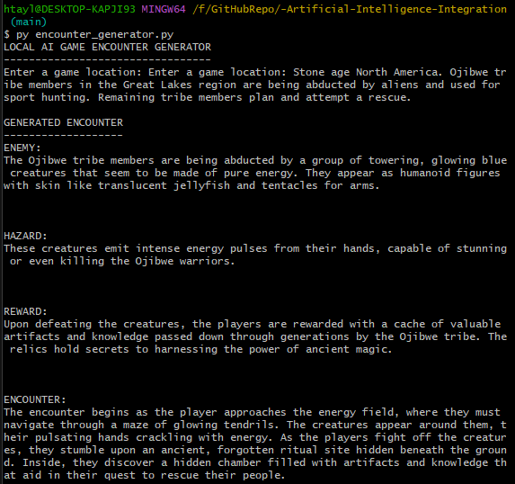
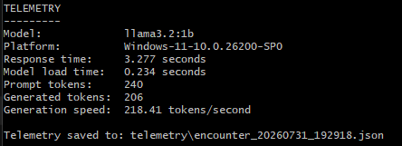
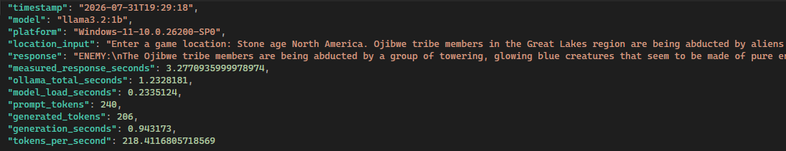

---

## `COMMENTARY.md`

# Artificial Intelligence Integration Mini-Project Commentary

## Project Overview

This mini-project implements a locally deployed generative AI feature for game development. The system generates a short game encounter from a location entered by the user. Each response contains an enemy, an environmental hazard, a reward, and a description of how those elements form a playable encounter.

The project was designed as a small standalone Python application rather than a full Unreal Engine integration. This reduced unnecessary complexity while still demonstrating local AI deployment, communication with an AI model, procedural content generation, telemetry collection, and exported results.

## AI Model and Local Deployment

The project uses Ollama to run the `llama3.2:1b` language model locally. Ollama provides a local HTTP API that can be accessed without a cloud account or API key.

The Python script sends a request to:

`http://localhost:11434/api/generate`

The request includes the model name, the generated prompt, and the option to disable streaming. Disabling streaming means that the complete response is returned in one JSON object, making it easier to process and save.

The `llama3.2:1b` model was selected because it is relatively lightweight and suitable for a small local demonstration. A larger model might produce more reliable or detailed content, but it would require more storage, memory, and processing time.

## Encounter Generation

The user enters a location such as an Antarctic science station, a flooded spaceship, or an abandoned railway station. The script inserts this location into a structured prompt.

The model is instructed to return four sections:

- `ENEMY`
- `HAZARD`
- `REWARD`
- `ENCOUNTER`

The enemy, hazard, and reward provide individual game-design components. The encounter section is intended to combine these elements into a short gameplay situation.

The prompt also requests geographically or contextually plausible details. However, fictional elements remain possible when they are explicitly introduced by the location. For example, a prompt referring to sentient radioactive penguins allows the model to create an intentionally unrealistic science-fiction creature.

## Output Formatting

Generative models do not always follow formatting instructions exactly. During testing, the model returned `Reward:` instead of the requested uppercase `REWARD:` heading. It also omitted a blank line between sections.

To improve consistency, a Python function named `normalize_headings()` was added. It searches for uppercase, lowercase, and title-case versions of each heading and replaces them with a standard uppercase format. It also inserts blank lines before headings.

This demonstrates an important practical point: AI output should not be trusted to provide perfectly structured data without additional validation or post-processing.

## Telemetry Collection

The program collects performance and generation telemetry from both Python and Ollama.

Python's `time.perf_counter()` measures the complete response time observed by the application. The Ollama response also provides model loading duration, total processing duration, prompt token count, generated token count, and generation duration.

The program calculates generation speed by dividing the number of generated tokens by the generation duration. Results are displayed in the terminal and saved to a timestamped JSON file.

One test produced the following results:

- Model: `llama3.2:1b`
- Response time: 3.424 seconds
- Model load time: 0.282 seconds
- Prompt tokens: 152
- Generated tokens: 246
- Generation speed: 238.42 tokens per second
- Platform: Windows 11

An earlier run took 7.755 seconds and included a model load time of 5.171 seconds. The later run was faster because the model had already been loaded into memory by Ollama.

## Image: Generated Encounter

This screenshot should show the entered location and the complete AI-generated encounter.

## Image: Telemetry Output

This screenshot should show the model name, response time, loading time, token counts, and generation speed.

## Image: Exported JSON

This screenshot should show one of the timestamped telemetry files open in a text editor or IDE.

## Benefits to Game Development

The system demonstrates how generative AI can support rapid ideation. A developer could enter a location and receive a starting point for enemies, hazards, rewards, and gameplay situations within seconds.

This could help during brainstorming, level design, tabletop-style encounter planning, quest generation, or early pre-production. The output is not intended to replace a designer. Instead, it acts as a source of suggestions that can be reviewed, edited, combined, or rejected.

Running the model locally also avoids sending prompts to an external cloud service. This may be useful when working with private project information or when an internet connection is unavailable.

## Limitations and Ethical Considerations

The model can produce inaccurate or inappropriate content. In an early test, it placed polar bears in Antarctica. Polar bears naturally live in the Arctic, meaning the response sounded plausible but was factually incorrect.

This is an example of an AI hallucination. Stronger prompting reduced some errors but could not guarantee factual accuracy. Human review is therefore required before generated content is used in a game.

There are also authorship and originality considerations. The system generates ideas from patterns learned during model training, while the developer selects the prompt, evaluates the response, and decides how the material is used. Generated output should be treated as draft material rather than unquestioned final content.

## Possible Extensions

The system could be extended to return structured JSON directly rather than plain text. This would allow enemies, hazards, rewards, and encounters to be imported into a game engine more reliably.

Other possible improvements include:

- generating several encounter alternatives;
- allowing the user to choose a genre or difficulty;
- validating locations against factual reference data;
- connecting the generator to Unreal Engine;
- storing all runs in a CSV file;
- comparing different local models;
- generating encounters based on live game state;
- adding content filters and validation rules.

## Conclusion

The project successfully demonstrates a local generative AI workflow using Python, Ollama, and `llama3.2:1b`. The application accepts a user-defined location, generates game-design content, displays performance telemetry, and saves each result to JSON.

The project also demonstrates the practical limitations of generative AI. Although the model can quickly produce creative and usable ideas, its formatting and factual accuracy are not guaranteed. The heading-normalisation function and the observed polar-bear hallucination both show why AI output requires validation and human oversight.
